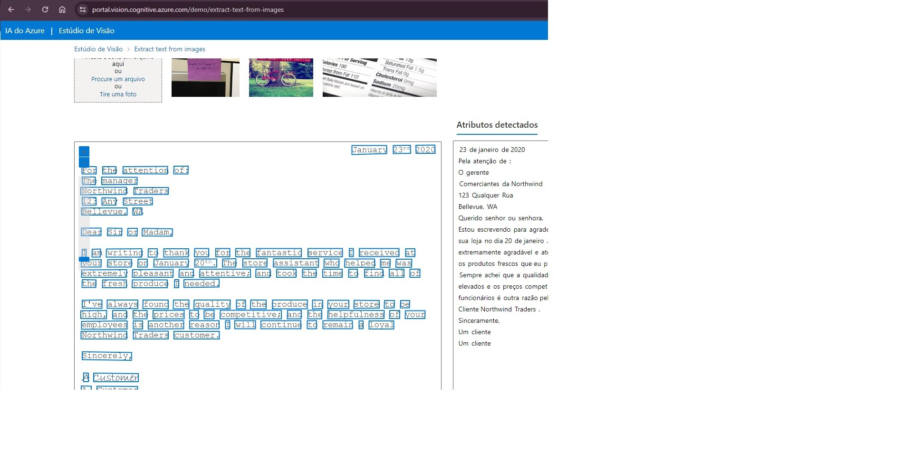

# Reconhecimento facial e transformação de imagens em Dados

* entrei no portal da Azure e criei um recurso de Serviços de Ia do Azure
depois de criado, entrei no Vision Studio para fazer as analises de imagens conforme a documentação
primeiro eu deixei o recurso criado como padrão, depois baixei as imagens.
* a primeira analise de imagem, foi a de adicionar legenda 
* Nessa imagem eu na opção de adicionar leganda densa na imagem e esse foi o resultado.

----------------------------------------------------------------------------------------------
* Nessa imagem eu coloquei para extrair tags

* nessa foi para mostrar o texto da imagem

## Nessa desafio eu aprendei adicionar imagem para a IA colocar legendas, extrair objetos e textos de imagens, e então o reconhecimento facial que ela faz.